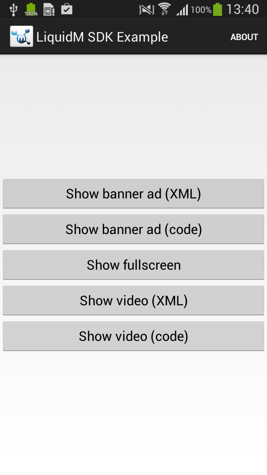
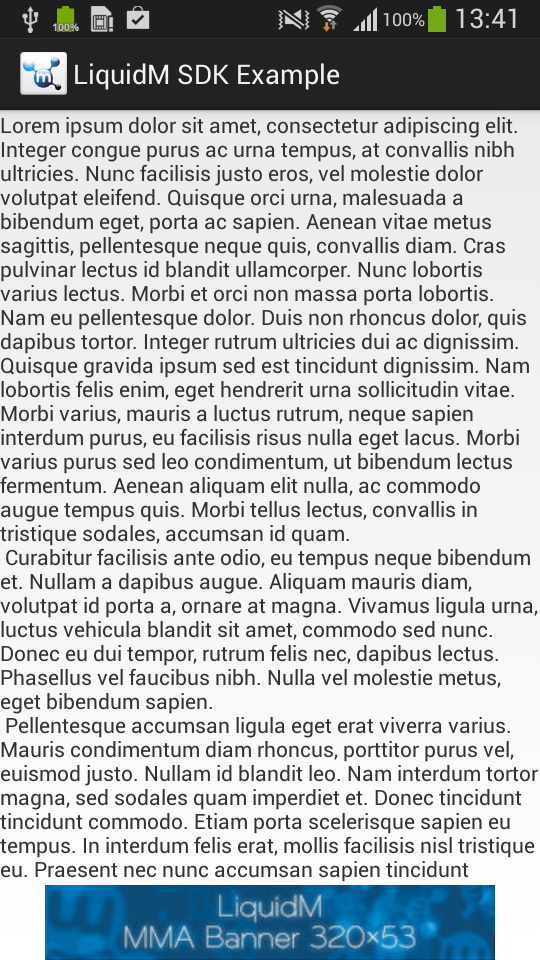

# LiquidM Android SDK
The LiquidM Android SDK allows you to request and present ads in your app. It includes the newest mobile ad technology and provides the following features:

- Support for banner and interstitial ads
  - text, image and [MRAID 2.0](http://www.iab.net/media/file/IAB_MRAID_v2_FINAL.pdf) (interactive rich media creatives) ad formats
  - industry standard banners sizes: mma, medium_rectangle, etc. and custom sized banners
  - standard and HD image banners
- Support for video ads (based on [VAST](http://www.iab.net/media/file/VASTv3.0.pdf))
  - pre-roll and post-roll video ads
  - landscape-portrait auto adaptation
- Support for DFP mediation
  - dedicated adapter for [DFP Network Mediation](https://developers.google.com/mobile-ads-sdk/docs/dfp/mediation) integrated into SDK

# Repository structure
This repository contains an example app (LiquidMSDKExample) and provides all the files to integrate the LiquidM Android SDK in your app. We suggest that you clone this repository with git (git clone https://github.com/liquidm/android-sdk-sample.git). If you're not familiar with git you can download the content of this repository as zip archive ([download](https://github.com/liquidm/android-sdk-sample/archive/master.zip)).

After you cloned this repository or unzipped the archive you'll find the following structure:

- [SDK](SDK): Actual SDK with [DFP Network Mediation](https://developers.google.com/mobile-ads-sdk/docs/dfp/mediation) adapter.
- [Example](Example): Example application.
- [GooglePlayServices](GooglePlayServices): Google Play Services library needed by example application.
- [CHANGELOG.md](CHANGELOG.md): Documentation of SDK changes.
- [README.md](README.md): This documentation.

# Try the example application
First of all you should try to open our example app which contains the LiquidM Android SDK already integrated. To do so, just import the [example project](Example) into Eclipse, attach the Android device and run it.

 

In the example application you can see how to properly integrate:
- banner ad (both in code and xml)
- interstitial ad
- video ad (both in code and xml)

# Integrate the SDK into your application
1. Copy [liquidmsdk.jar](SDK/liquidmsdk.jar) into libs/ directory of your project.
1. Set required permissions in AndroidManifest.xml

    ```xml
    <uses-permission android:name="android.permission.INTERNET"/>
    <uses-permission android:name="android.permission.ACCESS_WIFI_STATE"/>
    ```

1. Set optional permissions in AndroidManifest.xm

    ```xml
    <uses-permission android:name="android.permission.WRITE_EXTERNAL_STORAGE"/>
    <uses-permission android:name="android.permission.ACCESS_COARSE_LOCATION"/>
    <uses-permission android:name="android.permission.ACCESS_FINE_LOCATION"/>
    ```

1. Define AdActivity in AndroidManifest.xml

    ```xml
    <activity
      android:name="com.liquidm.sdk.AdActivity"
      android:configChanges="keyboard|keyboardHidden|orientation|uiMode|screenLayout|screenSize|smallestScreenSize" />
    ```

1. Add Google Play Services to your project

  1. [Install the Google Play Services SDK](http://developer.android.com/google/play-services/setup.html#Install)

  1. [Integrate your project with Google Play Services SDK](http://developer.android.com/google/play-services/setup.html#Setup)

# Use cases
This section contains some common uses and describes how to integrate different kinds of ads into your applicaiton. For banners and video ads you can choose to integrate them in layout xml files or in application code. Please make sure, that you replace the "TestTokn" with your personal token. The "TestTokn" contains example ads and allows you to test your implementation.

## Request banner ad in xml
1. Add liquidm namespace declaration to xml root element.

    ```xml
    xmlns:liquidm="http://schemas.android.com/apk/lib/com.liquidm.sdk"
    ```

1. Add AdView to your layout.

    ```xml
    <!-- Replace TestTokn with your personal token -->
    <!-- For adSize use one of: mma, medium_rectangle, leaderboard, portrait, landscape, xx_large
      or provide a custom size, for example: 320x50.
      Note that the custom size is given in device-independent pixels. -->

    <com.liquidm.sdk.AdView
      android:layout_width="wrap_content"
      android:layout_height="wrap_content"
      android:layout_gravity="center|bottom"
      liquidm:adSize="mma"
      liquidm:autoreload="true"
      liquidm:siteToken="TestTokn" />
    ```

See [example layout](Example/res/layout/activity_banner_ad_from_xml.xml) for more details.

See also [How to select the best fitting banner size for most android devices?](#how-to-select-the-best-fitting-banner-size-for-most-android-devices)

## Request banner ad in code

```java
// Replace TestTokn with your personal token.
String siteToken = "TestTokn";

// Select desired ad size (MMA, MEDIUM_RECTANGLE, LEADERBOARD, PORTRAIT, LANDSCAPE, XX_LARGE)
AdSize adSize = AdSize.MMA;
// or request custom sized ad using:
// (note that the custom size is given in device-independent pixels)
// AdSize adSize = new AdSize(320, 50);

AdView adView = new AdView(this, siteToken, adSize);

adView.setAutoreload(true);

layout.addView(adView, new FrameLayout.LayoutParams(
  LayoutParams.WRAP_CONTENT, LayoutParams.WRAP_CONTENT,
  Gravity.BOTTOM | Gravity.CENTER_HORIZONTAL));
```

See [example code](Example/src/com/liquidm/sdk/example/BannerAdFromCodeActivity.java) for more details.

See also [How to select the best fitting banner size for most android devices?](#how-to-select-the-best-fitting-banner-size-for-most-android-devices)

## Request interstitial ad and show it if ready.
1. Create and load InterstitialAd

    ```java
    @Override
    protected void onCreate(Bundle savedInstanceState) {
      // ...
    
      // Replace TestTokn with your personal token.
      String siteToken = "TestTokn";
    
      InterstitialAd interstitialAd = new InterstitialAd(this, siteToken);
    
      interstitialAd.loadAd();
    }
    ```

1. Show interstitial ad

    ```java
    private void showInterstitial() {
      if (interstitial.isReady()) {
        interstitial.show();
      }
    }
    ```
    
## Request interstitial ad and show it as soon as it is loaded
1. Create InterstitialAd, set its listener, and load it.

    ```java
    @Override
	  protected void onCreate(Bundle savedInstanceState) {
      // ..
      
      // Replace TestTokn with your personal token.
      String siteToken = "TestTokn";
      InterstitialAd interstitialAd = new InterstitialAd(this, SITE_TOKEN);
      interstitialAd.setListener(this);
      
      interstitialAd.loadAd();
    }  
    ```
    
1. Show interstitial ad in onAdLoad() event handler. Handle onAdFailedToLoad() event if needed.

    ```java
    @Override
    public void onAdLoad(Ad ad) {
      interstitial.show();
    }
    
    @Override
    public void onAdFailedToLoad(Ad ad) {
      Toast.makeText(this, getString(R.string.interstitial_load_failed), Toast.LENGTH_SHORT).show();
    }
    
    @Override
      public void onAdClick(Ad ad) {
    }
    
    @Override
      public void onAdPresentScreen(Ad ad) {
    }
    
    @Override
      public void onAdDismissScreen(Ad ad) {
    }
    
    @Override
      public void onAdLeaveApplication(Ad ad) {
    }
    ```

1. Stop ad loading in activity onPause() method to avoid showing interstitial after leaving the activity.

    ```java
    @Override
    protected void onPause() {
      super.onPause();
      interstitial.stopLoading();
    }
    ```

1. Add below line to your activity config in AndroidManifest.xml to avoid reloading interstitial ad every time device orientation changes.

    ```xml
    android:configChanges="keyboard|keyboardHidden|orientation|uiMode|screenLayout|screenSize|smallestScreenSize"
    ```

See example code [here](Example/src/com/liquidm/sdk/example/FullscreenAdActivity.java) and [here](Example/AndroidManifest.xml) for more details.


## Request video ad in xml
1. Add liquidm namespace declaration to xml root element

    ```xml
    xmlns:liquidm="http://schemas.android.com/apk/lib/com.liquidm.sdk"
    ```

1. Add VideoAdView to your layout.
Remember to set your siteToken and videoPath.

    ```xml
    <!-- Replace TestTokn with your personal token. -->
    <!-- Enter videoPath to your video file. -->
    <com.liquidm.sdk.VideoAdView
        android:layout_width="200dp"
        android:layout_height="150dp"
        android:layout_gravity="center"
        liquidm:videoPath=""
        liquidm:siteToken="TestTokn" />
    ```

See [example layout](Example/src/com/liquidm/sdk/example/VideoAdFromCodeActivity.java) for more details.

See [Video ad fullscreen mode](#video-ad-fullscreen-mode) for fullscreen mode integration instructions.

## Request video ad in code

```java
// Replace TestTokn with your personal token.
String siteToken = "TestTokn";
 // Enter path to your video file here.
String videoPath = "";

videoAdView = new VideoAdView(this, siteToken, videoPath);

int width = TypedValue.applyDimension(TypedValue.COMPLEX_UNIT_DIP, 200, r.getDisplayMetrics());
int height = TypedValue.applyDimension(TypedValue.COMPLEX_UNIT_DIP, 150, r.getDisplayMetrics());

FrameLayout mainLayout = (FrameLayout) findViewById(R.id.main_layout);
FrameLayout.LayoutParams params = new FrameLayout.LayoutParams(width, height);
mainLayout.addView(videoAdView, params);
```

See [example code](Example/res/layout/activity_video_ad_from_xml.xml) for more details.

See [Video ad fullscreen mode](#video-ad-fullscreen-mode) for fullscreen mode integration instructions.

# Request banner ad through DFP adapter

1. Integrate LiquidM SDK like described [above](#integrate-the-sdk-into-your-application)

1. Request AdMob banner ad like described [here](https://developers.google.com/mobile-ads-sdk/docs/admob/fundamentals) using AdMob *ad unit id* with configured LiquidM mediation.

# Request interstitial ad through DFP adapter

1. Integrate LiquidM SDK like described [above](#integrate-the-sdk-into-your-application)

1. Request AdMob interstitial ad like described [here](https://developers.google.com/mobile-ads-sdk/docs/admob/advanced) using AdMob *ad unit id* with configured LiquidM mediation.

# Other
## Video ad fullscreen mode
VideoAdView supports fullscreen mode, but part of its implementation have to be done by user.

Basic fullscreen mode implementation can be found in example in [VideoAdViewFullscreenModeProvider.java](Example/src/com/liquidm/sdk/example/VideoAdViewFullscreenModeProvider.java).

Follow below instructions to implement fullscreen mode the same way as it is implemented in example:

1. Copy [VideoAdViewFullscreenModeProvider.java](Example/src/com/liquidm/sdk/example/VideoAdViewFullscreenModeProvider.java) and its dependencies from example to your project.

1. Enable VideoAdView fullscreen button:

    ```java
    videoAdView.setFullscreenButtonVisible(true);
    ```

1. Create VideoAdViewFullscreenModeProvider:

    ```java
    videoAdViewFullscreenModeProvider = new VideoAdViewFullscreenModeProvider(activity, videoAdView, 16, 9);
    ```
16:9 is the aspect ratio that VideoAdViewFullscreenModeProvider will try to maintain while video player is in normal mode.

1. Invoke VideoAdViewFullscreenModeProvider.update():

    ```java
    @Override
    public void onWindowFocusChanged(boolean hasFocus) {
        super.onWindowFocusChanged(hasFocus);

        videoAdViewFullscreenModeProvider.update();
    }

    @Override
    public void onConfigurationChanged(Configuration newConfig) {
        super.onConfigurationChanged(newConfig);

        videoAdViewFullscreenModeProvider.update();
    }
    ```

1. Implement VideoAdViewFullscreenModeProvider.Listener and hide/show remaining activity content when video player goes into fullscreen/normal mode:

    ```java
    public void onFullscreenChanged(boolean fullscreen) {
        if (fullscreen) {
            // hide content except VideoAdView
        } else {
           // show hidden content
        }
    }
    ```

1. Remember to hide title bar on older devices to avoid it in fullscreen mode.
Add the following code to Activity.onCreate():

    ```java
    protected void onCreate(Bundle savedInstanceState) {
        super.onCreate(savedInstanceState);

        if (android.os.Build.VERSION.SDK_INT < android.os.Build.VERSION_CODES.HONEYCOMB) {
            requestWindowFeature(Window.FEATURE_NO_TITLE);
        }

        setContentView(R.layout.activity_video_ad_from_code);
        // ...
    }
    ```

See also [VideoAdFromCode.java](Example/src/com/liquidm/sdk/example/VideoAdFromCodeActivity.java)
or [VideoAdFromXml.java](Example/src/com/liquidm/sdk/example/VideoAdFromXmlActivity.java) for more details.

# FAQ
## How to select the best fitting banner size for most Android devices?
LiquidM banners sizes are measured in device-independent pixels. It means that for example 300x50 ad will look similarly on different devices, but will occupy different area measured in pixels.
On Android there are four categories of screen densities: ldpi, mdpi, hdpi, xhdpi and each one has its own scaling factor like on the image below:


So a 300x50 (300dp x 50dp) ad will occupy:
- 225px x 37.5px on ldpi screen
- 300px x 50px on mdpi screen
- 450px x 75px on hdpi screen
- 600px x 100px on xhdpi screen

Having this in mind and knowing screen resolutions and densities of the devices that are the most important for you, you can determine the minimum screen size for every density category.

Having minimum screen sizes for every density category you can choose an ad size that will fit them all.

For example, if your minimal screen sizes for each density category are:
- 240px x 400px on ldpi
- 320px x 480px on mdpi
- 480px x 800px on hdpi
- 1200px x 1920px on xhdpi

then you should choose a banner with size no greater that 320x480.
